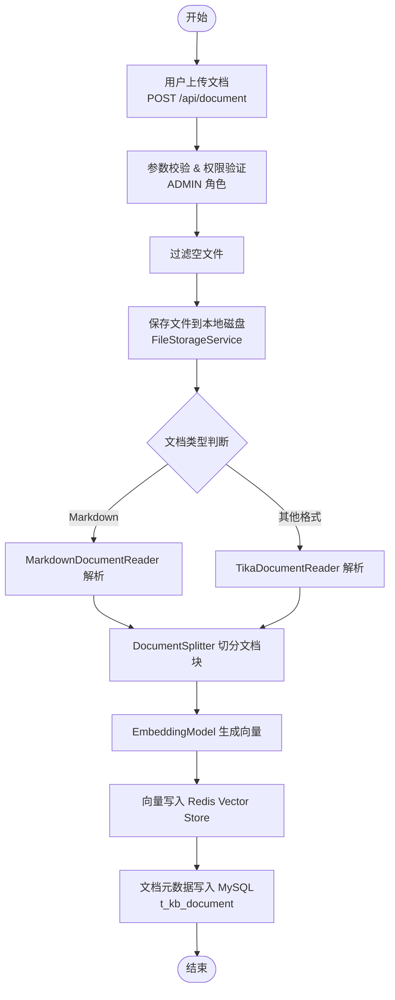
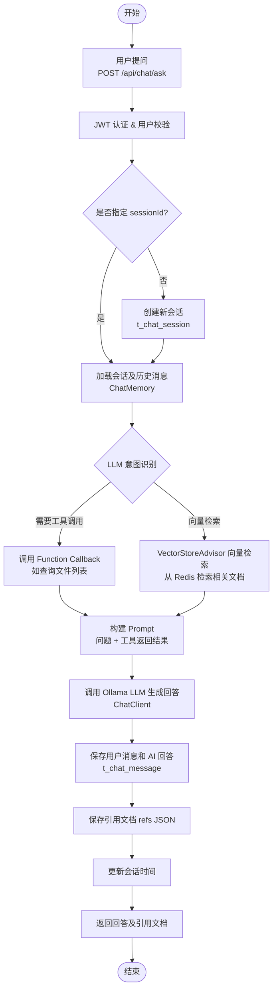
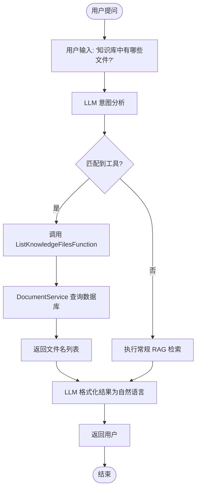

# spring-ai-rag-study

Spring AI RAG（检索增强生成）知识库系统后端。

## 项目概述

基于 Spring AI 2.0.0 + Spring Boot 4.1.1 构建的 RAG
知识库系统，支持文档上传解析、向量存储检索与智能问答对话。系统采用分层架构设计，提供完整的用户认证、知识库分类管理、文档管理、聊天会话等功能。

## 技术栈

| 类别        | 技术                                          |
|-----------|---------------------------------------------|
| 框架        | Spring Boot 4.1.1-SNAPSHOT, Spring AI 2.0.0 |
| Java 版本   | Java 21                                     |
| 关系型数据库    | MySQL 9.7.0 / MariaDB 3.5.9                 |
| 向量数据库     | Redis（使用 Jedis 连接）                          |
| LLM       | Ollama (phi4-mini:latest)                   |
| Embedding | Ollama (embeddinggemma:latest)              |
| ORM       | MyBatis Plus 3.5.16                         |
| 安全        | Spring Security + JWT                       |
| 工具库       | Lombok, MapStruct, Hutool                   |
| 文档解析      | Tika, Markdown Reader                       |
| 数据校验      | Spring Boot Starter Validation              |
| 虚拟线程      | Spring Boot Virtual Threads                 |

## 模块结构

```
spring-ai-rag-study/
├── pom.xml                          # 父 POM（依赖管理、插件配置）
├── LICENSE                          # Apache 2.0 许可证
├── .gitignore                       # Git 忽略配置
├── doc/
│   └── init_database.sql             # 数据库初始化脚本
└── spring-ai-rag-knowledge-database/ # 知识库系统主模块
    ├── pom.xml
    └── src/main/
        ├── java/com/ranyk/spring/ai/rag/knowledge/database/
        │   ├── SpringAiRagKnowledgeDatabaseApplication.java  # 启动类
        │   ├── ai/                   # AI 相关
        │   │   ├── advisor/           # 自定义 Advisor
        │   │   │   └── CustomSimpleLoggerAdvisor.java
        │   │   └── function/          # Function Callback 工具
        │   │       └── ListKnowledgeFilesFunction.java  # 知识库文件列表查询工具
        │   ├── api/                  # REST API 接口层
        │   │   ├── auth/              # 认证接口
        │   │   │   └── AuthApi.java
        │   │   ├── user/              # 用户接口
        │   │   │   └── AppUserApi.java
        │   │   ├── category/          # 分类接口
        │   │   │   └── CategoryApi.java
        │   │   ├── document/          # 文档接口
        │   │   │   └── DocumentApi.java
        │   │   ├── chat/              # 聊天接口
        │   │   │   ├── session/
        │   │   │   │   └── ChatSessionApi.java
        │   │   │   └── message/
        │   │   │       └── ChatMessageApi.java
        │   │   └── stats/             # 统计接口
        │   │       └── StatsApi.java
        │   ├── base/                 # 基础类
        │   │   └── domain/            # 基础领域模型
        │   │       ├── dto/            # 基础 DTO
        │   │       │   ├── BaseDTO.java
        │   │       │   └── StoredFile.java
        │   │       ├── entity/         # 基础实体
        │   │       │   └── BaseEntity.java
        │   │       ├── po/             # 基础 PO
        │   │       │   └── PageQueryPO.java
        │   │       └── vo/             # 基础 VO
        │   │           ├── MultiResult.java
        │   │           └── Result.java
        │   ├── common/               # 公共组件
        │   │   ├── constant/          # 常量枚举
        │   │   │   ├── DatabaseTypeEnum.java
        │   │   │   ├── FileTypeEnum.java
        │   │   │   └── StatusEnum.java
        │   │   └── exception/         # 异常定义
        │   │       ├── BaseException.java
        │   │       ├── DataSourceException.java
        │   │       ├── FileException.java
        │   │       └── ServiceException.java
        │   ├── config/               # 配置类
        │   │   ├── properties/        # 配置属性类
        │   │   │   ├── CorsProperties.java
        │   │   │   ├── FileProperties.java
        │   │   │   ├── HikariDataSourceProperties.java
        │   │   │   ├── JwtProperties.java
        │   │   │   ├── RdbProperties.java
        │   │   │   └── VectorStoreProperties.java
        │   │   ├── AdvisorConfiguration.java
        │   │   ├── ApplicationConfiguration.java
        │   │   ├── ChatClientConfiguration.java
        │   │   ├── ChatMemoryConfiguration.java
        │   │   ├── DocumentSplitterConfiguration.java
        │   │   ├── EmbeddingModelConfiguration.java
        │   │   ├── FaviconConfiguration.java
        │   │   ├── I18nConfiguration.java
        │   │   ├── JacksonConfiguration.java
        │   │   ├── LlmModelConfiguration.java
        │   │   ├── MyBatisPlusConfiguration.java
        │   │   ├── OllamaApiConfiguration.java
        │   │   ├── RedisAndRedisVectorStoreConfiguration.java
        │   │   ├── SecurityConfiguration.java
        │   │   ├── UploadBootstrapConfiguration.java
        │   │   ├── VectorStoreConfiguration.java
        │   │   ├── VirtualThreadConfiguration.java
        │   │   └── WebMvcConfiguration.java
        │   ├── domain/               # 业务领域层（entity/dto/po/vo/mapstruct）
        │   │   ├── user/              # 用户领域
        │   │   ├── document/          # 文档领域
        │   │   ├── chat/              # 聊天领域
        │   │   │   ├── session/
        │   │   │   └── message/
        │   │   ├── category/          # 分类领域
        │   │   ├── log/               # 日志领域
        │   │   └── login/             # 登录领域
        │   ├── filter/               # 过滤器
        │   │   └── JwtAuthFilter.java
        │   ├── handle/               # 全局处理器
        │   │   ├── GlobalWebExceptionHandler.java
        │   │   └── MyBatisPlusMetaObjectHandler.java
        │   ├── repository/           # 数据访问层（MyBatis Plus）
        │   │   ├── user/
        │   │   ├── document/
        │   │   ├── chat/
        │   │   ├── category/
        │   │   ├── log/
        │   │   └── stats/
        │   ├── service/              # 业务服务层
        │   │   ├── auth/              # 认证服务
        │   │   ├── user/              # 用户服务
        │   │   ├── category/          # 分类服务
        │   │   ├── document/          # 文档服务
        │   │   ├── file/              # 文件存储服务
        │   │   ├── rag/               # RAG 摄入服务
        │   │   ├── chat/              # 聊天服务
        │   │   │   ├── session/
        │   │   │   └── message/
        │   │   ├── stats/             # 统计服务
        │   │   └── log/               # 日志服务
        │   └── utils/                # 工具类
        │       ├── DocumentParseUtils.java
        │       ├── JwtUtils.java
        │       ├── MathUtils.java
        │       ├── MessageUtils.java
        │       ├── SecurityUtils.java
        │       └── WebUtils.java
        └── resources/
            ├── application.yml       # 主配置
            ├── mybatis-plus.yml      # MyBatis Plus 配置
            ├── rdb-datasource.yml    # 关系型数据库配置
            ├── vdb-datasource.yml    # 向量数据库配置
            ├── nrdb-datasource.yml    # 非关系型数据库配置
            ├── llm-model.yml         # LLM 模型配置
            ├── jwt.yml               # JWT 配置
            ├── file.yml              # 文件上传配置
            ├── language.yml          # 国际化配置
            ├── log.yml               # 日志配置
            ├── rdb.yml               # 关系型数据库 ORM 配置
            ├── i18n/                  # 国际化资源文件
            │   ├── messages.properties
            │   ├── messages_en_US.properties
            │   └── messages_zh_CN.properties
            ├── META-INF/spring/
            │   └── org.springframework.boot.autoconfigure.AutoConfiguration.imports
            ├── static/
            │   └── favicon.ico
            └── repository/           # MyBatis XML 映射文件
                ├── user/
                ├── document/
                ├── chat/
                ├── category/
                ├── log/
                └── stats/
```

## 数据库表

| 表名             | 说明                    |
|----------------|-----------------------|
| t_user         | 用户表（支持 ADMIN/USER 角色） |
| t_kb_category  | 知识库分类表                |
| t_kb_document  | 知识文档表（存储文件元数据与向量状态）   |
| t_chat_session | 聊天会话表                 |
| t_chat_message | 聊天消息表（包含引用文档 JSON）    |
| t_system_log   | 系统日志表                 |

## 核心功能

- **用户认证**：JWT Token 认证，支持登录、密码加密存储
- **用户管理**：用户 CRUD、头像上传、密码修改、个人资料更新
- **知识库分类**：分类的增删查，支持排序
- **文档管理**：支持多文件上传、Tika 解析、Markdown 解析、文档向量化、向量存储、文件列表查询
- **向量检索**：基于 Redis Vector Store 实现相似度检索
- **智能问答**：结合 RAG 向量检索与 LLM 生成回答，支持引用文档展示
- **Function Calling**：支持 AI 工具调用，可查询知识库文件列表等扩展能力
- **聊天会话**：支持多轮对话、会话列表、会话删除、上下文记忆
- **统计仪表盘**：管理员概览统计数据
- **系统日志**：操作日志记录
- **国际化**：支持中英文多语言
- **RBAC 权限**：基于角色的访问控制（ADMIN / USER）

## 架构设计

### 总体架构图

```mermaid
graph TB
    subgraph Client[客户端]
        Browser[Web 浏览器]
        App[移动 App]
        ThirdParty[第三方系统]
    end

    subgraph Gateway[接入层]
        Nginx[Nginx / 负载均衡]
        CORS[CORS 跨域处理]
    end

    subgraph Application[Spring Boot 应用 - spring-ai-rag-knowledge-database]
        subgraph Security[安全认证层]
            JWTFilter[JWT 认证过滤器]
            SecurityConfig[Spring Security]
        end

        subgraph API[API 接口层]
            AuthApi[认证接口 /api/auth]
            UserApi[用户接口 /api/user]
            CategoryApi[分类接口 /api/category]
            DocumentApi[文档接口 /api/document]
            ChatSessionApi[会话接口 /api/chat/session]
            ChatMessageApi[聊天接口 /api/chat]
            StatsApi[统计接口 /api/stats]
        end

        subgraph Service[业务服务层]
            AuthService[认证服务]
            UserService[用户服务]
            CategoryService[分类服务]
            DocumentService[文档服务]
            FileService[文件存储服务]
            RagIngestService[RAG 摄入服务]
            ChatSessionService[会话服务]
            ChatMessageService[聊天服务]
            StatsService[统计服务]
            LogService[日志服务]
        end

        subgraph AI[AI 能力层]
            ChatClient[ChatClient]
            FunctionCallback[Function Callback<br/>工具调用]
            VectorStoreAdvisor[VectorStoreAdvisor]
            EmbeddingModel[EmbeddingModel]
            ChatMemory[ChatMemory]
            DocumentSplitter[文档切分器]
            DocumentReader[文档读取器<br/>Tika / Markdown]
        end

        subgraph Repository[数据访问层]
            UserRepo[用户 Repository]
            CategoryRepo[分类 Repository]
            DocumentRepo[文档 Repository]
            ChatSessionRepo[会话 Repository]
            ChatMessageRepo[消息 Repository]
            LogRepo[日志 Repository]
            StatsRepo[统计 Repository]
        end
    end

    subgraph Data[数据存储层]
        MySQL[(MySQL / MariaDB<br/>关系型数据库)]
        Redis[(Redis<br/>向量数据库 + 缓存)]
        FileSystem[本地文件系统<br/>文档存储]
        Ollama[Ollama<br/>LLM + Embedding 服务]
    end

    Browser --> Nginx
    App --> Nginx
    ThirdParty --> Nginx
    Nginx --> CORS
    CORS --> JWTFilter
    JWTFilter --> API
    SecurityConfig -.-> JWTFilter

    AuthApi --> AuthService
    UserApi --> UserService
    CategoryApi --> CategoryService
    DocumentApi --> DocumentService
    ChatSessionApi --> ChatSessionService
    ChatMessageApi --> ChatMessageService
    StatsApi --> StatsService

    AuthService --> UserService
    DocumentService --> FileService
    DocumentService --> RagIngestService
    ChatMessageService --> ChatSessionService
    StatsService --> UserService
    StatsService --> DocumentService
    StatsService --> LogService

    RagIngestService --> DocumentReader
    RagIngestService --> DocumentSplitter
    RagIngestService --> EmbeddingModel
    ChatMessageService --> ChatClient
    ChatClient --> FunctionCallback
    ChatClient --> VectorStoreAdvisor
    ChatClient --> ChatMemory

    UserService --> UserRepo
    CategoryService --> CategoryRepo
    DocumentService --> DocumentRepo
    ChatSessionService --> ChatSessionRepo
    ChatMessageService --> ChatMessageRepo
    LogService --> LogRepo
    StatsService --> StatsRepo

    UserRepo --> MySQL
    CategoryRepo --> MySQL
    DocumentRepo --> MySQL
    ChatSessionRepo --> MySQL
    ChatMessageRepo --> MySQL
    LogRepo --> MySQL
    StatsRepo --> MySQL

    VectorStoreAdvisor --> Redis
    EmbeddingModel --> Ollama
    ChatClient --> Ollama
    FileService --> FileSystem
```



### 分层架构图

```mermaid
graph TD
    subgraph L7[配置层 Config]
        ConfigClasses[配置类<br/>Security / Redis / MyBatis / Web 等]
        Properties[配置属性类<br/>Rdb / Jwt / File / Cors 等]
    end

    subgraph L6[公共层 Common]
        Constants[常量枚举<br/>DatabaseType / FileType / Status]
        Exceptions[异常定义<br/>Base / Service / File / DataSource]
        Utils[工具类<br/>Jwt / Security / DocumentParse 等]
    end

    subgraph L5[基础层 Base]
        BaseEntity[基础实体 BaseEntity]
        BaseDTO[基础 DTO<br/>BaseDTO / StoredFile]
        BasePO[基础 PO<br/>PageQueryPO]
        BaseVO[基础 VO<br/>Result / MultiResult]
    end

    subgraph L4[领域层 Domain]
        UserDomain[用户领域<br/>entity / dto / po / vo / mapstruct]
        CategoryDomain[分类领域<br/>entity / dto / po / vo / mapstruct]
        DocumentDomain[文档领域<br/>entity / dto / po / vo / mapstruct]
        ChatDomain[聊天领域<br/>session / message]
        LogDomain[日志领域<br/>entity / dto / mapstruct]
        LoginDomain[登录领域<br/>dto / po / vo / mapstruct]
    end

    subgraph L3[数据访问层 Repository]
        UserRepository[AppUserRepository]
        CategoryRepository[CategoryRepository]
        DocumentRepository[DocumentRepository]
        ChatSessionRepository[ChatSessionRepository]
        ChatMessageRepository[ChatMessageRepository]
        SystemLogRepository[SystemLogRepository]
        StatsRepository[StatsRepository]
    end

    subgraph L2[业务服务层 Service]
        AuthService2[AuthService]
        UserService2[AppUserService]
        CustomUserDetails[CustomUserDetailsService]
        CategoryService2[CategoryService]
        DocumentService2[DocumentService]
        FileStorageService[FileStorageService]
        RagIngestService2[RagIngestService]
        ChatSessionService2[ChatSessionService]
        ChatMessageService2[ChatMessageService]
        StatsService2[StatsService]
        SystemLogService[SystemLogService]
    end

    subgraph L1[接口层 API]
        AuthApi2[AuthApi]
        AppUserApi[AppUserApi]
        CategoryApi2[CategoryApi]
        DocumentApi2[DocumentApi]
        ChatSessionApi2[ChatSessionApi]
        ChatMessageApi2[ChatMessageApi]
        StatsApi2[StatsApi]
    end

    subgraph L0[接入层 Filter / Handle]
        JwtAuthFilter[JwtAuthFilter]
        GlobalExceptionHandler[GlobalWebExceptionHandler]
        MetaObjectHandler[MyBatisPlusMetaObjectHandler]
    end

    L0 --> L1
    L1 --> L2
    L2 --> L3
    L3 --> L4
    L4 --> L5
    L6 --> L2
    L6 --> L3
    L6 --> L4
    L7 --> L0
    L7 --> L2
    L7 --> L3
```



### 核心流程

#### 文档上传与向量化流程



#### RAG 问答流程



#### Function Calling 工具调用流程



#### 认证与授权流程

```mermaid
flowchart TD
    Start([请求开始]) --> JwtFilter[JwtAuthFilter]
    JwtFilter --> HasToken{请求头是否有 Token?}
    HasToken -->|否| Continue[放行到匿名接口<br/>或返回 401]
    HasToken -->|是| ParseToken[JwtUtils 解析 Token]
    ParseToken --> Valid{Token 有效?}
    Valid -->|否| Continue
    Valid -->|是| GetUser[获取用户信息]
    GetUser --> SetContext[设置 SecurityContext]
    SetContext --> Api[进入 API 接口]
    Api --> PreAuthorize{@PreAuthorize<br/>权限校验}
    PreAuthorize -->|通过| Service[执行业务逻辑]
    PreAuthorize -->|拒绝| Forbidden[返回 403 无权限]
    Service --> End([请求结束])
    Forbidden --> End
    Continue --> End
```

## API 接口

### 认证接口

| 接口                | 方法   | 权限 | 说明   |
|-------------------|------|----|------|
| `/api/auth/login` | POST | 公开 | 用户登录 |

### 用户接口

| 接口                      | 方法     | 权限    | 说明       |
|-------------------------|--------|-------|----------|
| `/api/user/me`          | GET    | 登录用户  | 获取当前用户信息 |
| `/api/user/me/profile`  | PUT    | 登录用户  | 更新个人资料   |
| `/api/user/me/avatar`   | POST   | 登录用户  | 上传头像     |
| `/api/user/me/password` | PUT    | 登录用户  | 修改密码     |
| `/api/user/page`        | GET    | ADMIN | 分页查询用户   |
| `/api/user`             | POST   | ADMIN | 新增/更新用户  |
| `/api/user/{id}`        | DELETE | ADMIN | 删除用户     |

### 分类接口

| 接口                   | 方法     | 权限    | 说明   |
|----------------------|--------|-------|------|
| `/api/category`      | GET    | 登录用户  | 分类列表 |
| `/api/category`      | POST   | ADMIN | 新增分类 |
| `/api/category/{id}` | DELETE | ADMIN | 删除分类 |

### 文档接口

| 接口                      | 方法     | 权限    | 说明         |
|-------------------------|--------|-------|------------|
| `/api/document`         | POST   | ADMIN | 上传文档并向量化    |
| `/api/document/list`    | GET    | ADMIN | 分页查询文档     |
| `/api/document/filenames` | GET  | ADMIN | 获取知识库文件列表  |
| `/api/document/{id}`    | DELETE | ADMIN | 删除文档及向量    |

### 聊天会话接口

| 接口                              | 方法     | 权限   | 说明   |
|---------------------------------|--------|------|------|
| `/api/chat/session`             | GET    | 登录用户 | 会话列表 |
| `/api/chat/session/{sessionId}` | DELETE | 登录用户 | 删除会话 |

### 聊天消息接口

| 接口                                       | 方法   | 权限   | 说明      |
|------------------------------------------|------|------|---------|
| `/api/chat/ask`                          | POST | 登录用户 | 提问（RAG） |
| `/api/chat/session/{sessionId}/messages` | GET  | 登录用户 | 会话消息列表  |

### 统计接口

| 接口                    | 方法  | 权限    | 说明      |
|-----------------------|-----|-------|---------|
| `/api/stats/overview` | GET | ADMIN | 仪表盘概览统计 |

## 配置文件说明

项目采用多配置文件拆分，通过 `application.yml` 的 `spring.config.import` 引入：

- `application.yml` - 主配置（服务端口、应用名称）
- `mybatis-plus.yml` - MyBatis Plus 配置
- `rdb-datasource.yml` - MySQL 数据源配置
- `vdb-datasource.yml` - Redis 向量存储配置
- `nrdb-datasource.yml` - 非关系型数据库配置
- `llm-model.yml` - Ollama LLM 及 Embedding 模型配置
- `jwt.yml` - JWT 密钥和过期时间配置
- `file.yml` - 文件上传路径配置
- `language.yml` - 国际化配置
- `log.yml` - 日志级别配置
- `rdb.yml` - 关系型数据库 ORM 配置（跳过自动填充表等）

## 快速开始

### 前置条件

1. JDK 21
2. Maven 3.8+
3. MySQL 8.0+ 或 MariaDB 10.5+
4. Redis 6.0+（支持向量搜索）
5. Ollama（已部署并运行，已拉取 phi4-mini 和 embeddinggemma 模型）

### 初始化数据库

```bash
mysql -u root -p < doc/init_database.sql
```

默认管理员账号：

- 用户名：`admin`
- 密码：`admin`

### 修改配置

编辑 `spring-ai-rag-knowledge-database/src/main/resources/` 下的配置文件：

1. `rdb-datasource.yml` - 设置 MySQL 连接信息
2. `llm-model.yml` - 设置 Ollama 服务地址和模型名称
3. `vdb-datasource.yml` - 设置 Redis 连接信息
4. `file.yml` - 设置文件上传存储路径
5. `rdb.yml` - 设置需要跳过自动填充的表（可选）

### 构建运行

```bash
mvn clean package -DskipTests
cd spring-ai-rag-knowledge-database
java -jar target/spring-ai-rag-knowledge-database-0.0.1-SNAPSHOT.jar
```

服务默认运行在 `http://localhost:8083`

### 本地开发

```bash
mvn spring-boot:run -pl spring-ai-rag-knowledge-database
```

## 项目结构说明

### 父 POM

父 POM 位于根目录，负责：

- 统一管理所有依赖版本（dependencyManagement）
- 配置 Maven 编译插件及注解处理器顺序（Lombok → MapStruct）
- 配置资源插件及编码
- 定义子模块列表

### 主模块

`spring-ai-rag-knowledge-database` 是主业务模块，包含所有业务逻辑实现。

## Function Calling 工具扩展

本项目支持 Spring AI 的 Function Calling 机制，允许 LLM 在对话过程中自动调用预定义的工具方法。

### 已实现的工具

#### 1. ListKnowledgeFilesFunction - 知识库文件列表查询

**功能**：查询知识库中已上传的文件列表

**触发场景**：
- "知识库中有哪些文件？"
- "列出所有文档"
- "当前有什么文件？"
- 其他询问知识库文件的相关问题

**实现位置**：`com.ranyk.spring.ai.rag.knowledge.database.ai.function.ListKnowledgeFilesFunction`

**使用方式**：
- 用户通过自然语言提问
- LLM 自动识别意图并调用工具
- 返回格式化的文件名列表（自然语言）

### 如何扩展新工具

1. 创建新的 Function Callback 类，使用 `@Component` 注解
2. 在方法上添加 `@Tool` 注解，并提供详细的 `description`
3. 方法参数使用 `@ToolParam` 注解描述参数用途
4. 在 `ChatClientConfiguration` 中注册该工具（通过 `.tools()` 方法）

**示例**：
```java
@Component
public class MyCustomFunction {
    
    @Tool(description = "工具的描述，告诉 LLM 这个工具的用途")
    public String myMethod(
        @ToolParam(description = "参数描述") String param
    ) {
        // 实现逻辑
        return "结果";
    }
}
```

## License

Apache License 2.0